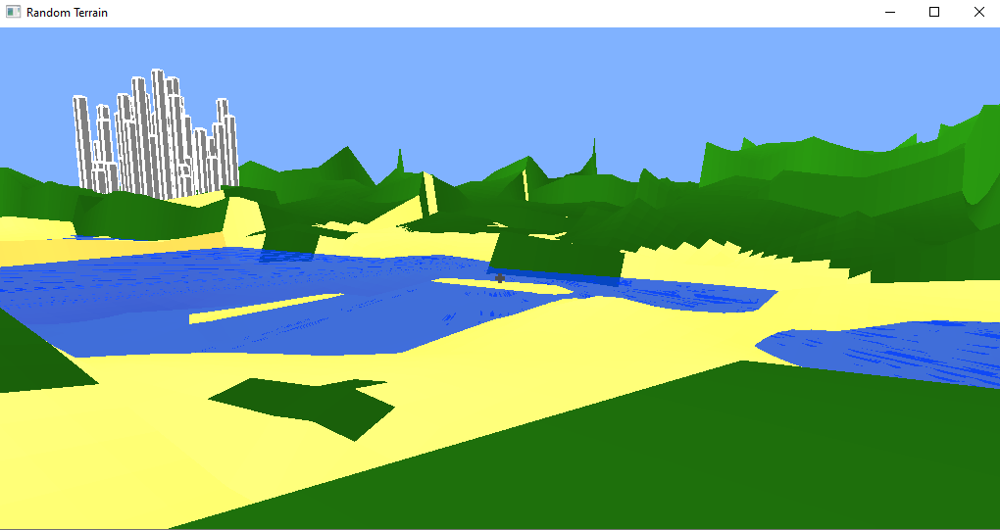
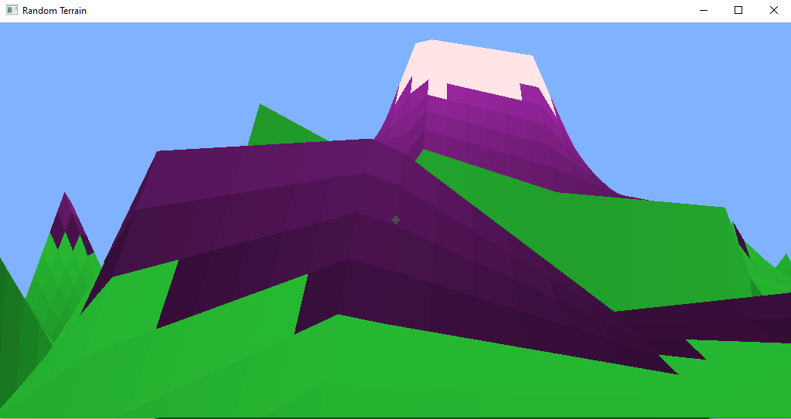
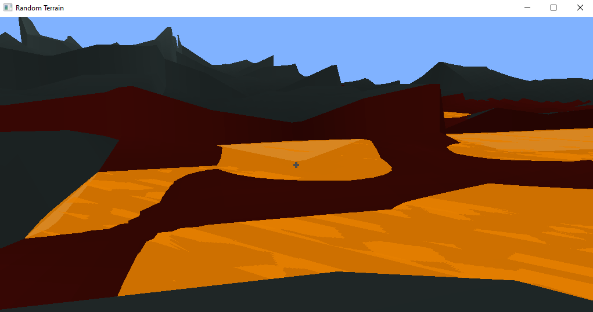
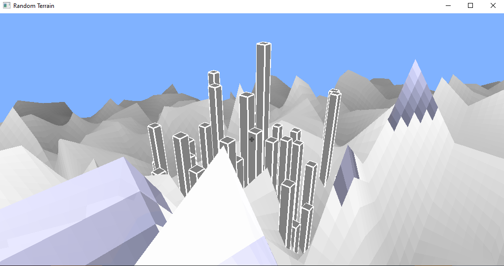

# Random Terrain
This game uses OpenGL/Glut to randomly generate a 3D world with random terrain for the player to
explore. Move with w,a,s,d and press the spacebar to jump. Hold e while moving to go fast.
Press p to pause. On the pause menu, you can cycle through different color schemes for the world.

## Build Instructions
If you are on windows, you need to download freeglut, make the
directory C:/Program Files/Common Files/freeglut/, copy the 
include/ and lib/ folders from freeglut into there, and copy
freeglut.dll from freeglut/bin/ into the cmake-build-debug/ folder.

If you are not on windows, it might just work.

## Screenshots

A lake, hills, and a city.

Mountains.

Lava.

A city in snowy mountains.
